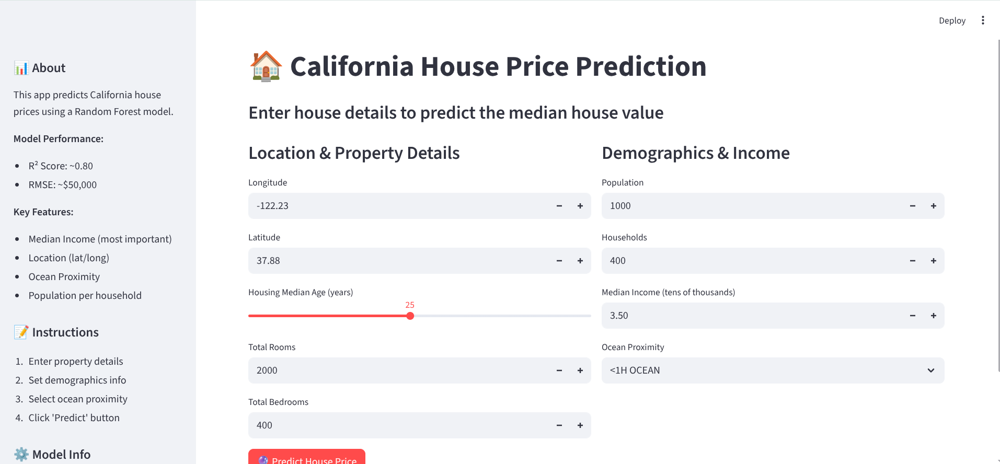

# 🏠 California House Price Prediction

A machine learning project that predicts California house prices using Random Forest Regression with an interactive Streamlit web application.



## 🎯 Project Overview

This project uses the California Housing dataset to build a predictive model that estimates median house values based on various features such as location, demographics, and property characteristics. The model is deployed as an interactive web application using Streamlit.

## ✨ Features

- **Interactive Web Interface**: User-friendly Streamlit app for real-time predictions
- **Multiple ML Models**: Linear Regression, Random Forest, Gradient Boosting, SVR
- **Model Optimization**: Hyperparameter tuning using GridSearchCV
- **Feature Engineering**: Custom features like rooms per household, population per household
- **Comprehensive EDA**: Detailed exploratory data analysis with visualizations
- **Model Evaluation**: RMSE, R² Score, Cross-validation, Feature importance

## 🚀 Live Demo

Run the application locally:
```bash
streamlit run app.py
```

## 📊 Model Performance

- **R² Score**: ~0.80 (80% variance explained)
- **RMSE**: ~$50,000
- **Best Model**: Random Forest Regressor

### Key Features (by importance):
1. Median Income (51.7%)
2. Population per Household (13.4%)
3. Ocean Proximity (7.1%)
4. Location (Latitude/Longitude)

## 🛠️ Technologies Used

- **Python 3.13**
- **Machine Learning**: scikit-learn
- **Data Analysis**: pandas, numpy
- **Visualization**: matplotlib, seaborn
- **Web App**: Streamlit
- **Development**: Jupyter Notebook

## 📁 Project Structure

```
House_Pricing_Prediction/
│
├── app.py                      # Streamlit web application
├── house_price.ipynb           # Jupyter notebook with full analysis
├── housing.csv                 # California housing dataset
├── house_price_model.pkl       # Trained Random Forest model
├── scaler.pkl                  # Feature scaler
├── label_encoder.pkl           # Ocean proximity encoder
├── requirements.txt            # Python dependencies
├── screenshot.png              # App screenshot
└── README.md                   # Project documentation
```

## 🔧 Installation

### Prerequisites
- Python 3.7 or higher
- pip package manager

### Setup

1. **Clone the repository**
```bash
git clone https://github.com/ZahidMiana/House-Price-Prediction-.git
cd House-Price-Prediction-
```

2. **Create virtual environment**
```bash
python -m venv .venv
source .venv/bin/activate  # On Windows: .venv\Scripts\activate
```

3. **Install dependencies**
```bash
pip install -r requirements.txt
```

4. **Train the model (REQUIRED - first time only)**
   
   Open and run the Jupyter notebook to generate model files:
```bash
jupyter notebook house_price.ipynb
```
   
   Run all cells in the notebook. This will create:
   - `house_price_model.pkl`
   - `scaler.pkl`
   - `label_encoder.pkl`

   **Note**: Model files are not included in the repository due to GitHub file size limits.

5. **Launch Streamlit App**
```bash
streamlit run app.py
```

The app will open in your browser at `http://localhost:8501`

## 📝 Usage

### Web Application

1. Enter property details:
   - Location (Longitude, Latitude)
   - Housing median age
   - Total rooms and bedrooms
   
2. Provide demographics:
   - Population
   - Households
   - Median income
   
3. Select ocean proximity

4. Click **"🔮 Predict House Price"**

5. View predicted median house value with price category (Budget/Mid-range/Premium)

### Jupyter Notebook

The notebook includes:
- Data loading and exploration
- Missing value analysis
- Feature engineering
- Model training (Linear Regression, Random Forest, Gradient Boosting)
- Hyperparameter tuning
- Model evaluation and comparison
- Visualization and insights

## 📈 Dataset

**California Housing Dataset**
- **Rows**: 20,640 housing blocks
- **Features**: 10 columns
- **Target**: median_house_value

### Features Description:

| Feature | Description |
|---------|-------------|
| longitude | How far west the house is |
| latitude | How far north the house is |
| housing_median_age | Median age of houses in the block |
| total_rooms | Total number of rooms in the block |
| total_bedrooms | Total number of bedrooms in the block |
| population | Total population in the block |
| households | Total number of households in the block |
| median_income | Median income (in tens of thousands) |
| median_house_value | Median house value (TARGET) |
| ocean_proximity | Location relative to ocean |

## 🧪 Model Training Pipeline

1. **Data Preprocessing**
   - Handle missing values (207 missing in total_bedrooms)
   - Create engineered features
   - Encode categorical variables
   - Feature scaling

2. **Model Selection**
   - Train multiple models
   - Compare performance metrics
   - Select best performing model

3. **Hyperparameter Tuning**
   - GridSearchCV for optimal parameters
   - Cross-validation (5-fold)

4. **Model Evaluation**
   - RMSE and R² Score
   - Prediction vs Actual plots
   - Feature importance analysis

## 🎨 Screenshots

### Prediction Results
The app displays:
- Predicted house value
- Property summary
- Price category indicator
- Model performance metrics

## 🤝 Contributing

Contributions are welcome! Please feel free to submit a Pull Request.

1. Fork the project
2. Create your feature branch (`git checkout -b feature/AmazingFeature`)
3. Commit your changes (`git commit -m 'Add some AmazingFeature'`)
4. Push to the branch (`git push origin feature/AmazingFeature`)
5. Open a Pull Request

## 📄 License

This project is open source and available under the [MIT License](LICENSE).

## 👨‍💻 Author

**Zahid Miana**
- GitHub: [@ZahidMiana](https://github.com/ZahidMiana)
- Repository: [House-Price-Prediction-](https://github.com/ZahidMiana/House-Price-Prediction-)

## 🙏 Acknowledgments

- California Housing Dataset from scikit-learn
- Streamlit for the amazing web framework
- scikit-learn for machine learning tools

## 📞 Contact

For questions or feedback, please open an issue on GitHub.

---

**⭐ If you found this project helpful, please give it a star!**
